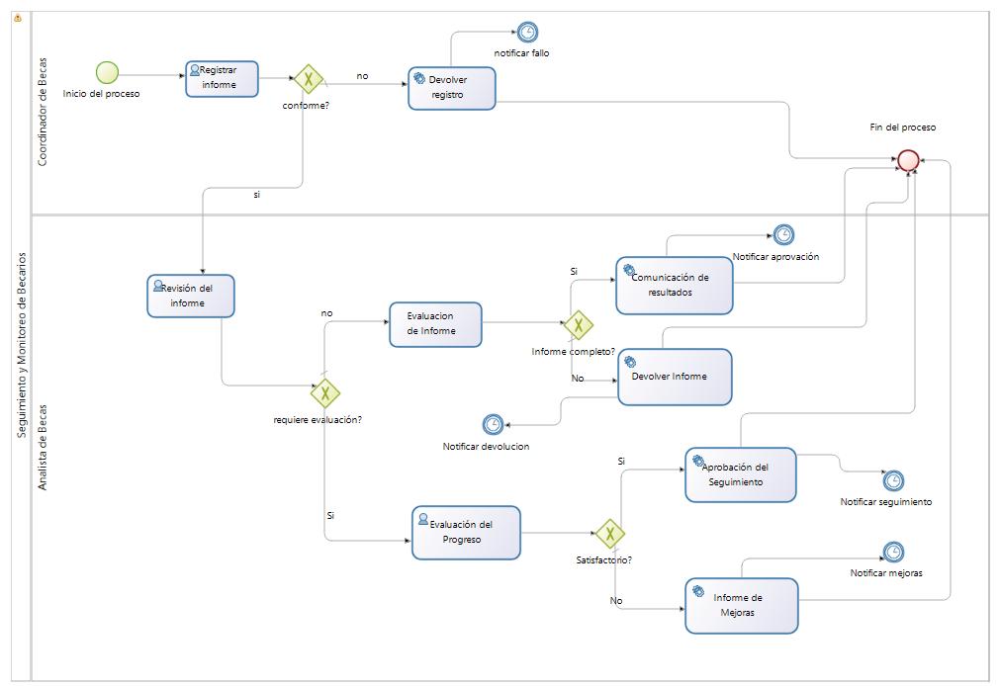
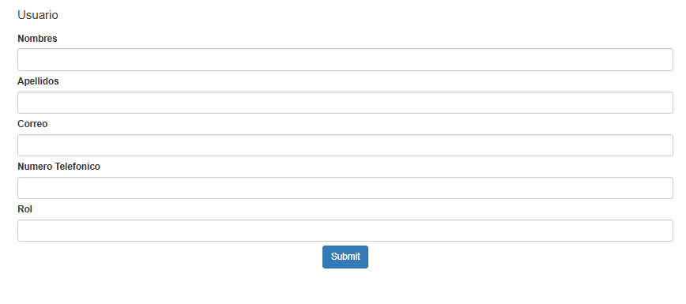
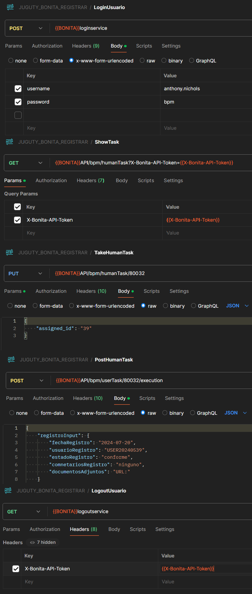
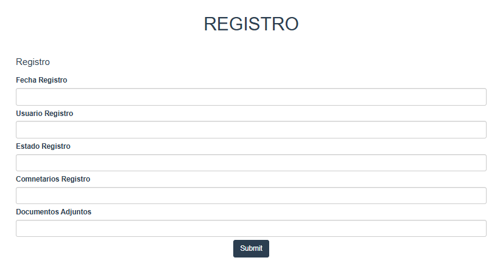
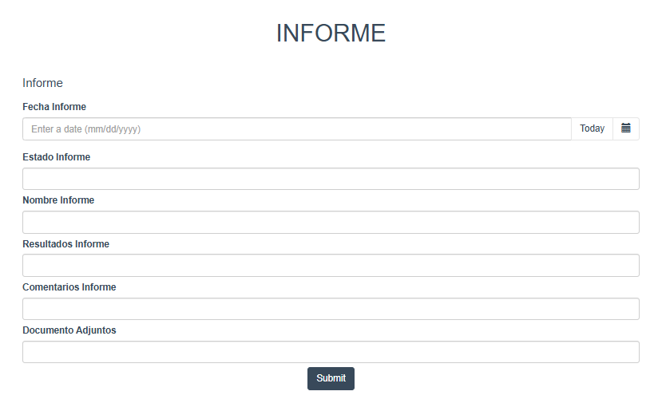
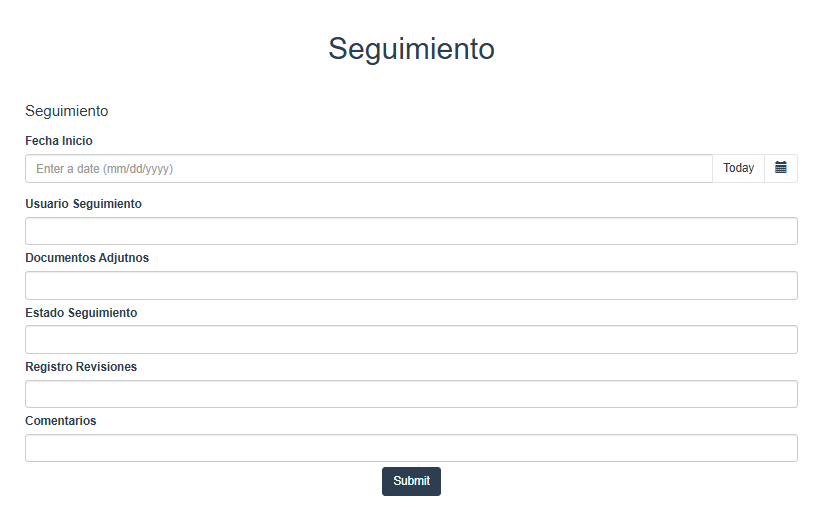

### 3.0 PROCESO DE GESTIÓN SEGUIMIENTO Y MONITEOREO DE BECARIOS
Este proceso describe el flujo de trabajo para la evaluación de informes, involucrando a dos actores principales: el Coordinador de Becas y el Analista de Becas. El proceso abarca tres flujos principales: el registro del informe, la revisión del informe y la evaluación del progreso.

#### ACTORES INVOLUCRADOS
1. Usuario Solicitante
2. Registrador
3. Evaluador
4. Personal de Seguimiento
#### FLUJO DEL PROCESO
1. Presentar Informe
   * Actor: Usuario Solicitante
   * Descripción: Usuario Solicitante es el iniciador del proceso el cual presenta los documentos con los datos mediante un formulario, este pobrá ser recibido o rechazado según su completitud
   * Contrato:
       * Nombres
       * Apellidos
       * Correo
       * Numero Telefonico
       * Rol
         
    * Formulario:
      
      !
      
    * API REST:
      
      
 

         
2. Registrar Informe
   * Actor: Registrador
   * Descripción: El Coordinador de Becas registra el informe en el sistema si este posee los documentos en orden, más no revisa el contenido de este que es entregado por el actor Solicitante. Si el informe no es conforme, se devuelve para corrección.
   * Contrato:
       * Fecha
       * Usuario
       * Estado
       * Comentarios
       * Documentos Adjuntos
    * Formulario:
      
      !

    * API REST:
    
     

         
3. Revisión del informe
   * Actor: Evaluador
   * Descripción: El Analista de Becas revisa el informe para verificar su conformidad. Si el informe requiere una evaluación más profunda, se procede a la evaluación del progreso.
   * Contrato:
       * Fecha
       * Estado
       * Nombre del Informe
       * Resultados
       * ComentariosInforme
       * DocumentosAdjuntos
    * Formulario
      
      !

         
4. Evaluación del progreso
   * Actor: Personal de Seguimiento
   * Descripción: Si se requiere, el Personal de Seguimiento realiza una evaluación del progreso. Dependiendo del resultado, el informe puede ser aprobado o devuelto para mejoras.
   * Contrato:
       * Fecha Incio
       * Usuario
       * Documentos Adjuntos
       * Estado de seguimiento
       * Resgistro de Revisiones previas
       * Comentarios
    * Formulario:
      
      

